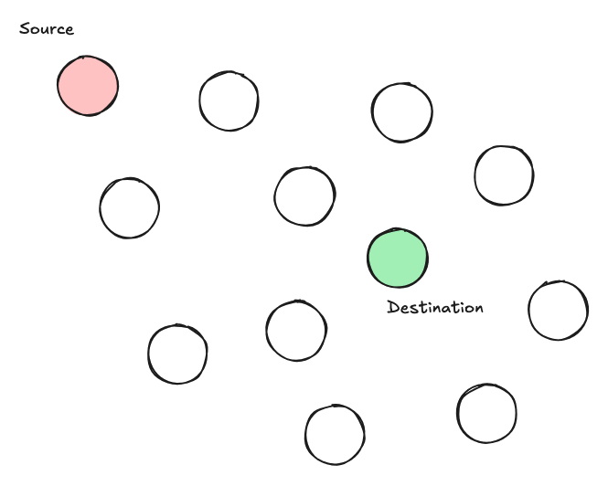

<h1 align="center">Hydrafiles</h1>

The (P2P) web privacy layer.

<strong>Hydrafiles is under heavy development and is very experimental.</strong> Some features like serving static files are production ready, while others may receive breaking changes frequently.

  <a href="https://github.com/StarfilesFileSharing/hydrafiles/releases">Quick Install</a>
    
  
    
  Please submit ideas & feature requests as well as any problems you're facing as a GitHub issue.
    
  <strong>Like our mission?</strong>
   
  If you're a developer, you can check our issues for ideas on how to help. Otherwise, check <a href="#contribute-to-hydrafiles">here</a> on how else you can contribute.

**Reading this on GitHub?** Check our docs at any Hydrafiles node such as [hydrafiles.com](https://hydrafiles.com).

## What is Hydrafiles?

Hydrafiles is a decentralised peer to peer network, anonymising the clear web by enabling anonymous internet access. Hydrafiles is accessible using normal web browsers without needing any end-user setup, accessible with HTTP, WebRTC, or
WebSockets.

Hydrafiles allows peers to route services (such as APIs) as well as static files through the network anonymising both the origin and destination. Unlike alternatives like Tor, it does so in a manor where not even the exit nodes know that
they are the exit node for any request.

## What environments does Hydrafiles run in?

Hydrafiles runs in both browsers and desktop/server with both an JS library available for both, and an executable or Docker container available for non-web environments.

P.s. Using **web nodes**, you are able to **serve APIs** and static files over WS and WebRTC, that are accessible as **HTTP endpoints**. Yes, you read that right.

## How is it anonymous?

TLDR: This scene ^

Hydrafiles uses Spartacus Routing. Spartacus Routing involves a gossip network where all peers act as one. No matter which peer you call, you will receive the same response.

When a peer receives a request, it first checks if it has a copy of the requested content. If it does, it will respond with it. If not, it will forward the request to known peers and mirror the response. If no peer has a copy of the
requested content, the request will return a 404 once peers timeout. Because the request is forwarded by each peer and all peers mirror the response, it is impossible to tell which peers the request or response originated from.

## Who's in charge of Hydrafiles?

No one, anyone, everyone. Hydrafiles doesn't have a head. It's simply an API specification. Anyone can setup a domain, server, S3 bucket, or literally just run a JavaScript library and connect to the network. The more people that decide to
do this, the more private the network.

## Where is Hydrafiles?

Hydrafiles is everywhere. With the goal of being cross-border, we ask people like you to contribute to the movement, by setting up cross-border domains and servers.

## What Hydrafiles isn't.

Hydrafiles does **not** hide content. All data on the Hydrafiles network can be seen by all peers. Sensitive content MUST be encrypted before submission to the network.
